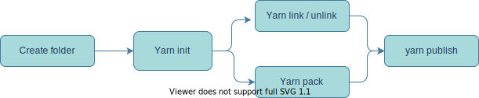

- [yarn-alpha](#yarn-alpha)
  - [What is yarn?](#what-is-yarn)
    - [Yarn Features:](#yarn-features)
      - [Offline mirroring](#offline-mirroring)
      - [Workspaces:](#workspaces)
      - [Auto-merging lock files](#auto-merging-lock-files)
  - [Installing yarn](#installing-yarn)
  - [Adding and removing packages](#adding-and-removing-packages)
    - [Yarn add example](#yarn-add-example)
    - [Removing package 'yarn remove'](#removing-package-yarn-remove)
  - [What is the significance of package.json](#what-is-the-significance-of-packagejson)
  - [Types of Dependencies](#types-of-dependencies)
    - [dependencies](#dependencies)
    - [devDependencies](#devdependencies)
    - [peerDependencies](#peerdependencies)
    - [optionalDependencies](#optionaldependencies)
    - [bundledDependencies](#bundleddependencies)
      - [Sample package.json](#sample-packagejson)
  - [semantic versioning](#semantic-versioning)
  - [Lock files and versioning](#lock-files-and-versioning)
  - [yarn outdated](#yarn-outdated)
  - [yarn upgrade](#yarn-upgrade)
  - [Exploring dependency tree](#exploring-dependency-tree)
    - [yarn list](#yarn-list)
  - [yarn why](#yarn-why)
  - [yarn info](#yarn-info)
  - [Advanced yarn features](#advanced-yarn-features)
  - [yarn config](#yarn-config)
  - [yarn scripts](#yarn-scripts)
  - [yarn run](#yarn-run)
  - [yarn autoclean](#yarn-autoclean)
  - [Global packages](#global-packages)
  - [yarn cache](#yarn-cache)
  - [Migrating an existing npm project to yarn](#migrating-an-existing-npm-project-to-yarn)
  - [yarn import](#yarn-import)
  - [yarn check](#yarn-check)
  - [Creating and publishing a package to npm registry](#creating-and-publishing-a-package-to-npm-registry)
  - [Create a package](#create-a-package)
  - [Referencing package locally](#referencing-package-locally)
  - [yarn link](#yarn-link)
  - [yarn unlink](#yarn-unlink)
  - [yarn pack](#yarn-pack)
  - [Publishing package to registry](#publishing-package-to-registry)
  - [Updating code and re publishing again](#updating-code-and-re-publishing-again)
  - [Publishing Sequence](#publishing-sequence)

# yarn-alpha

Yarn dependency management learning log

## What is yarn?

- A package manager
- Yarn provides the below mentioned advantages when compared to other package managers

  - **Offline Caching**: Once installed from npm from next time onwards these will be installed from local.
  - **Deterministic** : packages will be installed in same way if you are using same version of yarn.
  - **Network Performance**: network requests from Yarn are queued to maximize network utilization
  - **Network resilience**: if one request fails, it does not stop the whole install. Previously with NPM, if you couldn't get one package you were trying to install, the whole install would fail
  - **Flat node modules**: This keeps mismatching package versions from creating duplicates in the node modules and hoists packages to the top of the node modules, reducing the size of your total dependencies

  > Yarn and npm has different syntax, example npm install is equal to yarn add

  ### Yarn Features:

  #### Offline mirroring

  - Loads the dependency files to a local folder stored with tar extension which will be used not only for one project but for multiple projects.
  - This increases faster inter team installs and no access to internet after the first time.

  #### Workspaces:

  - Mono repo integration which is a concept originated from facebook. small projects are groups together to form a monorepo. Each project is called as a workspace.
  - Shared dependencies are kept in main directory called as monorepo all other projects can be invoked individually.

#### Auto-merging lock files

- Better version control integration and easy to resolve conflicts
  > yarn supports 2 factor authentication

> Npx is a command which ships with npm used to invoke other functionalities or package binaries like npx grunt.

## Installing yarn

- Yarn requires node js installation
- to install yarn globally `npm install -g yarn` or you can install through an msi
- `yarn -v` to check version of yarn installed.

## Adding and removing packages

- **yarn add** for adding new package
- **yarn remove** for removing a package

### Yarn add example

- Adding new package will create a node_modules folder, package.json, yarn.lock file
- if you do not want git to track node_modules folder add a .gitignore file
- Package.json will contain a json like below, general syntax: `yarn add express`

```
{
  "dependencies": {
    "express": "^4.17.1"
  }
```

- yarn.lock file will have packages, where they are downloaded from and a integrity hash

```
array-flatten@1.1.1:
  version "1.1.1"
  resolved "https://registry.yarnpkg.com/array-flatten/-/array-flatten-1.1.1.tgz#9a5f699051b1e7073328f2a008968b64ea2955d2"
  integrity sha1-ml9pkFGx5wczKPKgCJaLZOopVdI=
```

### Removing package 'yarn remove'

- general syntax for removing packages ` yarn remove express` will remove express.
- After removal the dependencies in package.json will be updated.
- yarn lock file will remove all the dependency references
- node_modules will have only an integrity file.

## What is the significance of package.json

- Every time when we add a new package or remove a package package.json will be updated.
- The corresponding dependencies will be downloaded, in node modules.
- if we remove node modules folder or download a new project from version control we need to set up all the dependencies.
- To do so we can use `yarn install` or `yarn` command as yarn default switch is install.
- To generate a package.json with all default attributes to start a project use `yarn init`
- a package.json generated by **yarn init** will look like below

```
{
  "name": "yarn-pilot-project",
  "version": "1.0.0",
  "description": "pilot project to learn yarn",
  "main": "index.js",
  "author": "dhruva",
  "license": "MIT"
}
```

- Once dependencies are added they will be added in package.json and node_modules will be downloaded.

## Types of Dependencies

### dependencies

These are your normal dependencies, or rather ones that you need when running your code.

### devDependencies

These are your development dependencies. Dependencies that you need at some point in the development workflow but not while running your code (e.g. Babel or Flow).

> To install dependency as a dev dependency use ` yarn install --dev <package-name>`

### peerDependencies

Peer dependencies are a special type of dependency that would only ever come up if you were publishing your own package.

Having a peer dependency means that your package needs a dependency that is the same exact dependency as the person installing your package. This is useful for packages like react that need to have a single copy of react-dom that is also used by the person installing it.

### optionalDependencies

Optional dependencies are just that: optional. If they fail to install, Yarn will still say the install process was successful.

This is useful for dependencies that won’t necessarily work on every machine and you have a fallback plan in case they are not installed (e.g. Watchman).

### bundledDependencies

Array of package names that will be bundled when publishing the package.

Bundled dependencies should be inside your project. The functionality is basically the same as normal dependencies. They will also be packed when running yarn pack.

Normal dependencies are usually installed from the npm registry. Bundled dependencies are useful in cases normal dependencies are not sufficient:

- When you want to re-use a third party library that doesn’t come from the npm registry or that was modified.
- When you want to re-use your own projects as modules.
- When you want to distribute some files with your module.

> To install all dependencies use `yarn install`

> To install only dependencies that are essential to run your app, use `yarn install --production`

#### Sample package.json

```
{
  "name": "my-project",
  "dependencies": {
    "package-a": "^1.0.0"
  },
  "devDependencies": {
    "package-b": "^1.2.1"
  },
  "peerDependencies": {
    "package-c": "^2.5.4"
  },
  "optionalDependencies": {
    "package-d": "^3.1.0"
  }
}
```

## semantic versioning

A way of versioning with three values example as below, Denoting the major minor and patch version.


- a character will placed in front of the version number in semantic versioning. The significance for the character and meaning is explained in the below table.

| Modifier | Usage           | Type                                   | Effective Range     | Description                                                                                                            |
| -------- | --------------- | -------------------------------------- | ------------------- | ---------------------------------------------------------------------------------------------------------------------- |
| none     | ‘4.9.5’         | Exact                                  | 0nly 4.9.5          | Use the exact and only version                                                                                         |
| =        | ‘=4.9.5’        | Exact                                  | Only 4.9.5          | Use the exact and only version                                                                                         |
| ^        | ‘^4.9.5’        | Latest Minor                           | 4.9.5 – 4.999.999   | Latest version greater than or equal to the current minor version, But it should be the current major version.         |
| ~        | ‘~4.9.5’        | Latest patch                           | 4.9.5 – 4.9.999     | Latest version greater than or equal to the current patch version, But the current major and minor should remain same. |
| >        | ‘>4.9.5’        | Greater Than                           | 4.9.6 – 999.999.999 | Any version greater than the current version mentioned                                                                 |
| <        | ‘<4.9.5’        | Less Than                              | 1.0.0 – 4.9.499     | Any version less than the current version mentioned                                                                    |
| >=       | ‘>=4.9.5’       | Greater than or equal to               | 4.9.5 – 999.999.999 | Any version greater than or equal to the current version mentioned.                                                    |
| <=       | ‘<=4.9.5’       | Less than or equal to                  | 1.0.0 – 4.9.5       | Any version less than or equal to the current version mentioned                                                        |
| \*       | ‘\*’            | Latest any                             | 0.0.0 – 999.999.999 | Latest version possible                                                                                                |
| x        | ‘x’             | Latest Any                             | 0.0.0 – 999.999.999 | Latest version possible                                                                                                |
| \*       | ‘4.\*’          | Latest any minor with major 4          | 4.0.0 – 4.999.999   | Any minor and patch version combination but with same major version as mentioned                                       |
| x        | ‘4.x’           | Latest any minor with major 4          | 4.0.0 – 4.999.999   | Any minor and patch version combination but with same major version as mentioned                                       |
| \*       | ‘4.9.\*’        | Latest patch with same minor and major | 4.9.0 – 4.9.999     | Any patch version with the mentioned major and minor version                                                           |
| x        | ‘4.9.x’         | Latest patch with same minor and major | 4.9.0 – 4.9.999     | Any patch version with the mentioned major and minor version                                                           |
| -        | ‘4.9.5 – 9.9.9’ | Between the range specified            | 4.5.9 – 9.9.9       | Any version between the range mentioned including the mentioned versions                                               |

> The same table is available as an image [semantic version cheat sheet](images/semantic-versioning-cheat-sheet.png)

## Lock files and versioning

- when we use yarn add <package_name> it will by default install the latest version.
- If you want to install a different version Later. In the package.json modify the version you need. The above mentioned semantic versioning wild cards can be used.
- Another way to install a particular version of dependency is ` yarn add <package_name>@version-number`. like `yarn add express@2.1.0`

The version details will be saved in the yarn.lock file as mentioned below:

Name of dependency with the version that can be allowed for installation, current version installed, where was the file downloaded from, integrity hash and dependencies.

In the below example, express can be installed with any minor version of 4 as major release, Current installed version being '4.17.1', download url, secure hash and dependencies are available. Few dependencies might not have dependencies.

```
express@^4.17.1:
  version "4.17.1"
  resolved "https://registry.yarnpkg.com/express/-/express-4.17.1.tgz#4491fc38605cf51f8629d39c2b5d026f98a4c134"
  integrity sha512-mHJ9O79RqluphRrcw2X/GTh3k9tVv8YcoyY4Kkh4WDMUYKRZUq0h1o0w2rrrxBqM7VoeUVqgb27xlEMXTnYt4g==
  dependencies:
    accepts "~1.3.7"
    array-flatten "1.1.1"
    body-parser "1.19.0"
    content-disposition "0.5.3"
    content-type "~1.0.4"
    cookie "0.4.0"
    cookie-signature "1.0.6"
    debug "2.6.9"
    depd "~1.1.2"
    encodeurl "~1.0.2"
    escape-html "~1.0.3"
    etag "~1.8.1"
    finalhandler "~1.1.2"
    fresh "0.5.2"
    merge-descriptors "1.0.1"
    methods "~1.1.2"
    on-finished "~2.3.0"
    parseurl "~1.3.3"
    path-to-regexp "0.1.7"
    proxy-addr "~2.0.5"
    qs "6.7.0"
    range-parser "~1.2.1"
    safe-buffer "5.1.2"
    send "0.17.1"
    serve-static "1.14.1"
    setprototypeof "1.1.1"
    statuses "~1.5.0"
    type-is "~1.6.18"
    utils-merge "1.0.1"
    vary "~1.1.2"
```

- Yarn always check the local cached repo for the current version of dependency you are looking for, if it is available it will get it from there, else it will load from the online repository.
- When we have a registry mocked or configured, yarn always searches for the dependency in that registry, if it is not available the it goes to the npm registry.

  > So priority for downloading dependencies is
  >
  > - priority:01 local cached files
  > - Priority:02 configured registry
  > - priority:03 npm registry

## yarn outdated

- Command to identify how many packages are having an outdated version currently being used.
- The yarn outdated output looks something like below when you have an older version of a specific dependency available in your package.json.

```
yarn outdated v1.22.5
info Color legend :
 "<red>"    : Major Update backward-incompatible updates
 "<yellow>" : Minor Update backward-compatible features
 "<green>"  : Patch Update backward-compatible bug fixes
Package Current Wanted Latest Package Type URL
express 4.10.0  4.10.0 4.17.1 dependencies http://expressjs.com/
Done in 0.83s.
```

## yarn upgrade

- Use this command to update any outdated versions of the dependencies.
- This command will update the version to the latest one displayed in output of `yarn outdated`.
- To upgrade a single dependency use the command `yarn upgrade <package-name>`.
- To upgrade all the packages in package.json use `yarn upgrade`
- In the above example `yarn upgrade express` will update express to 4.17.1, as it is with in the range.

## Exploring dependency tree

### yarn list

- This will list all the dependencies in a tree structure.

```
yarn list v1.22.5
├─ accepts@1.1.4
│  ├─ mime-types@~2.0.4
│  └─ negotiator@0.4.9
├─ content-disposition@0.5.0
├─ cookie-signature@1.0.5
├─ cookie@0.1.2
├─ crc@3.2.1
├─ debug@2.1.3
│  ├─ ms@0.7.0
│  └─ ms@0.7.0
├─ depd@1.0.1
├─ destroy@1.0.3
├─ ee-first@1.1.0
├─ escape-html@1.0.1
├─ etag@1.5.1
│  └─ crc@3.2.1
├─ express@4.10.0
│  ├─ accepts@~1.1.2
│  ├─ content-disposition@0.5.0
│  ├─ cookie-signature@1.0.5
│  ├─ cookie@0.1.2
│  ├─ debug@~2.1.0
│  ├─ depd@~1.0.0
│  ├─ escape-html@1.0.1
│  ├─ etag@~1.5.0
│  ├─ finalhandler@0.3.2
│  ├─ fresh@0.2.4
│  ├─ media-typer@0.3.0
│  ├─ merge-descriptors@0.0.2
│  ├─ methods@1.1.0
│  ├─ on-finished@~2.1.1
│  ├─ parseurl@~1.3.0
│  ├─ path-to-regexp@0.1.3
│  ├─ proxy-addr@~1.0.3
│  ├─ qs@2.3.0
│  ├─ range-parser@~1.0.2
│  ├─ send@0.10.1
│  ├─ serve-static@~1.7.1
│  ├─ type-is@~1.5.2
│  ├─ utils-merge@1.0.0
│  └─ vary@~1.0.0
├─ finalhandler@0.3.2
│  ├─ debug@~2.1.0
│  ├─ escape-html@1.0.1
│  └─ on-finished@~2.1.1
├─ forwarded@0.1.2
├─ fresh@0.2.4
├─ ipaddr.js@1.0.5
├─ media-typer@0.3.0
├─ merge-descriptors@0.0.2
├─ methods@1.1.0
├─ mime-db@1.12.0
├─ mime-types@2.0.14
│  └─ mime-db@~1.12.0
├─ mime@1.2.11
├─ ms@0.6.2
├─ negotiator@0.4.9
├─ on-finished@2.1.1
│  └─ ee-first@1.1.0
├─ parseurl@1.3.3
├─ path-to-regexp@0.1.3
├─ proxy-addr@1.0.10
│  ├─ forwarded@~0.1.0
│  └─ ipaddr.js@1.0.5
├─ qs@2.3.0
├─ range-parser@1.0.3
├─ send@0.10.1
│  ├─ debug@~2.1.0
│  ├─ depd@~1.0.0
│  ├─ destroy@1.0.3
│  ├─ escape-html@1.0.1
│  ├─ etag@~1.5.0
│  ├─ fresh@0.2.4
│  ├─ mime@1.2.11
│  ├─ ms@0.6.2
│  ├─ on-finished@~2.1.1
│  └─ range-parser@~1.0.2
├─ serve-static@1.7.2
│  ├─ escape-html@1.0.1
│  ├─ parseurl@~1.3.0
│  ├─ send@0.10.1
│  └─ utils-merge@1.0.0
├─ type-is@1.5.7
│  ├─ media-typer@0.3.0
│  └─ mime-types@~2.0.9
├─ utils-merge@1.0.0
└─ vary@1.0.1
```

## yarn why

- This command is used to know why a specific package exists in your dependency list.
- general syntax is ` yarn why <package-name>`
- from the above list for express, `yarn why send` will provide below mentioned output.
- 'send' package is installed because express package depends on it. we can also get other information.

```
yarn why v1.22.5
[1/4] Why do we have the module "send"...?
[2/4] Initialising dependency graph...
[3/4] Finding dependency...
[4/4] Calculating file sizes...
=> Found "send@0.10.1"
info Reasons this module exists
   - "express" depends on it
   - Hoisted from "express#send"
   - Hoisted from "express#serve-static#send"
info Disk size without dependencies: "44KB"
info Disk size with unique dependencies: "376KB"
info Disk size with transitive dependencies: "456KB"
info Number of shared dependencies: 10
Done in 0.19s.
```

## yarn info

- To find information on any specific package we can use this command
- Syntax being `yarn info <package-name>`. It will search the online registry and get info from readme.md file.
- we can also get specific portion of the document by using the heading names in the document.
- `yarn info express description` output is mentioned below.

```
yarn info v1.22.5
Fast, unopinionated, minimalist web framework
Done in 0.26s.
```

## Advanced yarn features

Not only yhe above mentioned features yarn also has many other advanced features. Config, ability add scripts, cleaning projects, caching etc

## yarn config

- To see default configurations of yarn for a project run `yarn config list`.

```
yarn config v1.22.5
info yarn config
{
  'version-tag-prefix': 'v',
  'version-git-tag': true,
  'version-commit-hooks': true,
  'version-git-sign': false,
  'version-git-message': 'v%s',
  'init-version': '1.0.0',
  'init-license': 'MIT',
  'save-prefix': '^',
  'bin-links': true,
  'ignore-scripts': false,
  'ignore-optional': false,
  registry: 'https://registry.yarnpkg.com',
  'strict-ssl': true,
  'user-agent': 'yarn/1.22.5 npm/? node/v12.16.2 win32 x64',
  lastUpdateCheck: 1600795223290
}
info npm config
{}
Done in 0.10s.
```

- To change any particular configuration component use the command as `yarn config set <setting-to-be-changed> <value>`
- Example `yarn config save-prefix '~'`
- We can also change the config settings by using a .yarnrc file.
- The global yarnrc file will be available in c:/users/<user-name>/.yarnrc in mac and linux it will be in home directory.
- If we modify the yarnrc file it will behave same like setting a config parameter.
- yarnrc file can exist for a project, if it is not available the default will be global rc file.

## yarn scripts

A dependency management tool not only manages dependencies, but it also maintains few processes like, running unit tests, building projects and starting projects this can be achieved by adding scripts objects in package.json.

## yarn run

- Add scripts object in package.json and give it an echo command as mentioned below.
- use `yarn run` command to invoke a script here it is `yarn run message`
- If we are using non yarn key words then we can use `yarn message`
- if you use a yarn key word then you have to use ` yarn run <script-name>` like `yarn run list` in below example

```
{
  "name": "yarn-pilot-project",
  "version": "1.0.0",
  "description": "pilot project to learn yarn",
  "main": "index.js",
  "author": "dhruva",
  "license": "MIT",
  "scripts": {
    "message": "echo hello-world",
    "list": "yarn list",
    "start": "node ./test.js"
  },
  "dependencies": {
    "express": "4.10.0"
  }
}

```

## yarn autoclean

This command is used to clean unnecessary files in the packages downloaded, this comes in handy when there is a necessity to load node modules to your version control. This might not reduce the memory size drastically, but huge number of files can be removed.

- Use ` yarn autoclean --init` to generate a '.yarnclean' file which will mention all the files that will be removed.
- An example yarnclean file is available in the code of this project.
- Once yarnclean file is generated from then on when we add a new dependency yarn will automatically clean unnecessary files.
- To run yarn autoclean on demand use ` yarn autoclean --force`.

## Global packages

- These are the packages that can be installed on an operating system and can be accessible from any where on an os.
- Examples for global packages are grunt, prettier etc.
- handling global packages with yarn all we need to do is use global as prefix

| command                             | usage                                 |
| ----------------------------------- | ------------------------------------- |
| yarn global list                    | to list all global packages installed |
| yarn global add <<package-name>>    | to add a new global package           |
| yarn global remove <<package-name>> | to remove a specific package          |
| yarn global upgrade                 | to upgrade a global packages          |

> The sub commands supported with yarn global are _add, bin, dir, ls, list, remove, upgrade, upgrade-interactive_.

## yarn cache

- Yarn caches all the packages locally
- `yarn cache list` provides the list of all the cached files locally.
- `yarn cache dir` provides the folder on which this caching is done. In windows it might be like `C:\Users\<<user-name>>\AppData\Local\Yarn\Cache\v6`
- `yarn cache clean` to remove all packages from cache.
- `yarn cache clean <<package-name>>` to remove a specific package from cache.
- To change the cache location for yarn use `yarn config set cache-folder <<new-path>>`.

## Migrating an existing npm project to yarn

NPM and yarn has a different package structure, the equivalent of the yarn.lock file for npm is package.lock.json. If we want to migrate from an NPM project to yarn by keeping exact dependency structure in place, use `yarn import` command.

## yarn import

- To import an existing npm project to yarn.
- This will check the package.json and generate a yarn.lock file.
- `yarn import` should be run in the root folder of project or the place where package.json is available.

## yarn check

- Used to check if the node modules are proper as per the lock file and are they installed or not.
- Generally after import from npm to yarn, there will be few errors and few packages that are not installed.
- Yarn check will show all the packages that are not installed and versions mismatching to resolve this we can run `yarn upgrade` which will upgrade all the packages and get the correct version of files.
- We can also check integrity of a project by using ` yarn check --integrity`.

> Transition from npm to yarn is not that perfect all the time, yarns tools can be utilized to make this transition better.

## Creating and publishing a package to npm registry

- Register in npmjs.com, required for publishing to npm registry.
- create a new package for publishing to npm.

## Create a package

- A new package is created in a folder called criptic-alpha
- To initiate it as aan yarn package navigate to folder and use `yarn init`.
- Provide proper name and other details.

```
{
  "name": "criptic-alpha",
  "version": "1.0.0",
  "description": "To encrypt and decrypt text",
  "main": "criptic.js",
  "repository": "git repository link",
  "author": "Name <email>",
  "license": "MIT",
  "dependencies": {
    "crypto": "^1.0.1"
  }
}
```

Criptic-alpha is a project which will help to encrypt and decrypt a text for more information [criptic-alpha-readme](https://github.com/Dhruvaraju/criptic-alpha/blob/master/README.md)

## Referencing package locally

While developing package locally, we cannot test it as a package. If we use yarn criptic-alpha it will not be found in registry. To test a package locally yarn provides `yarn link` command.

## yarn link

- used to add a local package to yarn in local file system.
- Navigate to root location of your package or the location where package.json is present and run ` yarn link`.
- this will add the current package to any project in your local machine with its name.
- to add the package in project use the command `yarn link <<package-name>>`.
- After adding yarn list will not show it as a package, but it will be added as a system link.

**example test after linking**

```javascript
const criptic = require("criptic-alpha");

let hash = criptic.encrypt("Hi how are you");
let text = criptic.decrypt(hash);

console.log(hash);
console.log(text);
```

## yarn unlink

- After testing and ready to publish you can remove link by using `yarn unlink <<package-name>>`.

There is another method of testing it locally.

## yarn pack

- This command will pack the package as a file that will be delivered from any registry
- Navigate to package root folder and run `` yarn pack`
- this will create a file like 'criptic-alpha-v1.0.0.tgz'
- if we extract it we will have only package.json and the js source code file, only these two will be loaded to registry
- We can now add this locally by using ``` yarn add <<package-location/package-name>>
- this will reflect in the package.json unlike yarn link.

## Publishing package to registry

- use `yarn publish` to publish your package to registry
- FIrst time while using it will ask log in credentials to npm.

## Updating code and re publishing again

- Update your code changes
- Test them locally by pack or link
- Updating version can be done in three ways
  - package.json manual update
  - running `yarn version` command in the root directory
  - just run `yarn publish` when it asks for new version number you can update it.

## Publishing Sequence


